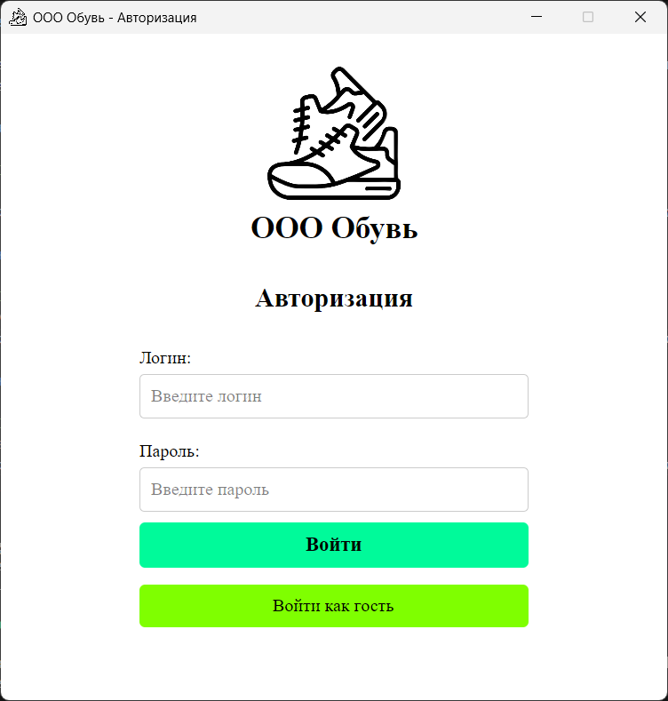
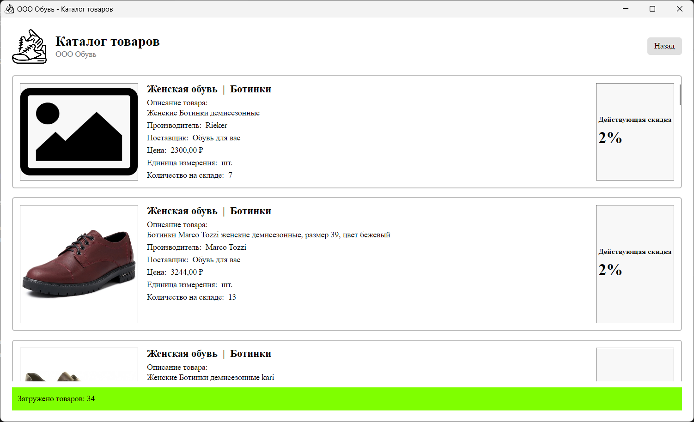
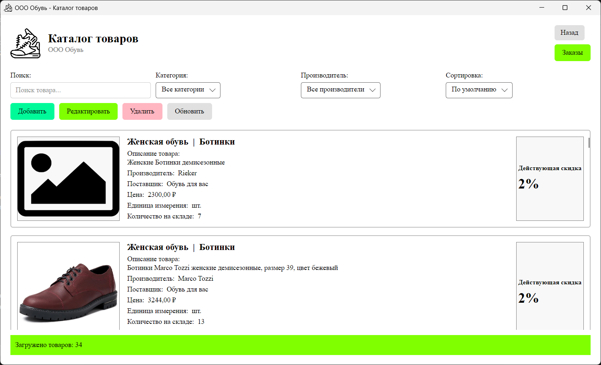
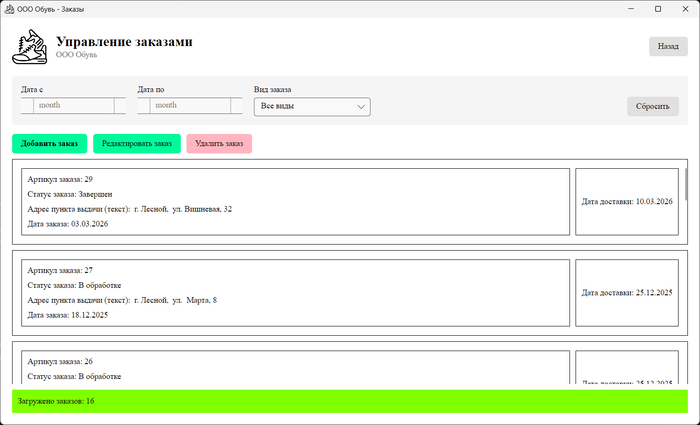
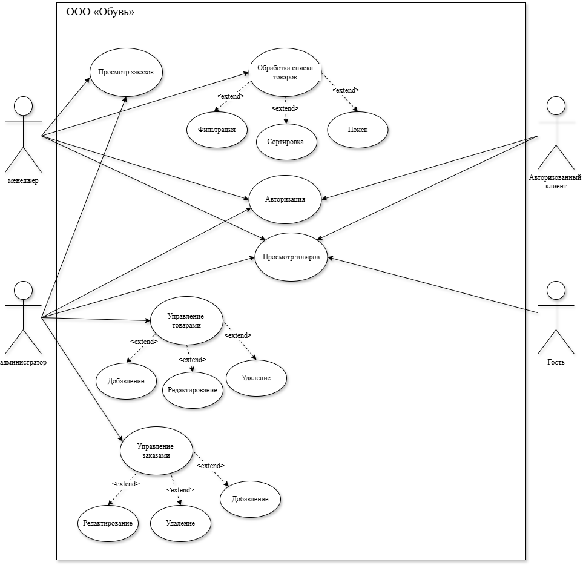

# Информационная система магазина «Обувь»

Данный проект представляет собой информационную систему для автоматизации работы магазина по продаже обуви ООО «Обувь». Система разработана в рамках выполнения задания демонстрационного экзамена и реализует ролевую модель доступа (Гость, Клиент, Менеджер, Администратор).

> Основная цель проекта — разграничение прав доступа к функциям просмотра, добавления и редактирования товаров и заказов в зависимости от роли пользователя.

## Содержание

- [Информационная система магазина «Обувь»](#информационная-система-магазина-обувь)
  - [Содержание](#содержание)
  - [Описание предметной области](#описание-предметной-области)
  - [Интерфейс приложения](#интерфейс-приложения)
  - [Функциональные возможности](#функциональные-возможности)
    - [Общий доступ (Гость)](#общий-доступ-гость)
    - [Клиент](#клиент)
    - [Менеджер](#менеджер)
    - [Администратор](#администратор)
  - [Роли и права доступа](#роли-и-права-доступа)
  - [Тестовые учетные записи](#тестовые-учетные-записи)
  - [Технологии](#технологии)
  - [Запуск приложения](#запуск-приложения)
    - [Требования](#требования)
    - [Установка и запуск](#установка-и-запуск)

## Описание предметной области

ООО **«Обувь»** — это розничный магазин по продаже обуви. Для повышения эффективности управления ассортиментом и заказами разрабатывается информационная система.


**Ключевые сущности:**
*   **Пользователи:** Сотрудники (администраторы, менеджеры) и клиенты магазина.
*   **Товары:** Обувь, представленная в каталоге (модель, размер, цена, артикул, фото).
*   **Заказы:** Список товаров, выбранных клиентом.

## Интерфейс приложения

Приложение имеет интуитивно понятный интерфейс, адаптированный под различные роли пользователей. Ниже представлены основные окна приложения.

### Главное окно входа

<!-- ВСТАВЬТЕ СКРИНШОТ ОКНА ВХОДА ВМЕСТО ЭТОГО КОММЕНТАРИЯ -->


*Рисунок 1 - Окно авторизации. Здесь пользователь может войти в систему или продолжить как гость.*

### Окно просмотра товаров

<!-- ВСТАВЬТЕ СКРИНШОТ ОКНА ТОВАРОВ ДЛЯ ГОСТЯ/КЛИЕНТА -->


*Рисунок 2 - Окно просмотра товаров (вид для гостя и клиента). Доступен только просмотр.*

### Окно товаров для менеджера и администратора

<!-- ВСТАВЬТЕ СКРИНШОТ ОКНА ТОВАРОВ С ФИЛЬТРАЦИЕЙ -->


*Рисунок 3 - Окно управления товарами для менеджера и администратора. Доступны фильтрация, сортировка и поиск.*

### Окно управления заказами

<!-- ВСТАВЬТЕ СКРИНШОТ ОКНА ЗАКАЗОВ -->


*Рисунок 4 - Окно управления заказами для менеджера и администратора.*

## Функциональные возможности

Система состоит из модуля авторизации и модулей управления данными, доступ к которым открывается в зависимости от роли.

### Общий доступ (Гость)
При запуске приложения пользователь видит окно входа, где он может:
1.  Ввести логин и пароль для авторизации.
2.  Перейти на экран просмотра товаров в роли **«Гость»**.

### Клиент
После авторизации в роли `Клиент` пользователю доступен:
*   Просмотр списка товаров (без фильтрации, сортировки и поиска).

### Менеджер
Авторизованный `Менеджер` может:
*   Просматривать список товаров с возможностями:
    *   **Фильтрация** (например, по категории, размеру).
    *   **Сортировка** (по цене, наименованию).
    *   **Поиск** (по артикулу или названию).
*   Просматривать список заказов.

### Администратор
`Администратор` обладает максимальными правами и может:
*   Управлять товарами (с фильтрацией, сортировкой, поиском):
    *   Просмотр
    *   **Добавление**
    *   **Редактирование**
    *   **Удаление**
*   Управлять заказами:
    *   Просмотр
    *   **Добавление**
    *   **Редактирование**
    *   **Удаление**

## Роли и права доступа

| Роль          | Авторизация | Товары: Просмотр |  Заказы: Просмотр |  Фильтрация/Поиск |
| :------------ | :---------: | :---------------: |  :--------------: | :------------------: |
| **Гость**     |      ❌      |         ✅      |        ❌         |        ❌         |
| **Клиент**    |      ✅      |         ✅      |        ❌         |        ❌         |
| **Менеджер**  |      ✅      |         ✅      |        ✅         |        ✅         |
| **Админ**     |      ✅      |         ✅      |        ✅         |        ✅         |





## Тестовые учетные записи

Для тестирования функциональности приложения можно использовать следующие учетные записи:

| Роль          | Логин    | Пароль |
| :------------ | :------- | :----- |
| **Админ**     | `admin`  | `1`    |
| **Менеджер**  | `manager`| `1`    |
| **Клиент**    | `autho`  | `1`    |


> Также вы всегда можете войти как **Гость**, нажав соответствующую кнопку в окне авторизации.

## Технологии

*   **Язык программирования:** C#
*   **Платформа:** .NET 6.0
*   **Тип приложения:** Windows Forms
*   **База данных:** PostgreSQL (PgAdmin)
*   **Работа с БД:** ADO.NET / Npgsql

## Запуск приложения

### Требования
*   Установленная среда выполнения .NET 6.0 (или выше).
*   Установленный и запущенный PostgreSQL (PgAdmin).
*   СУБД для просмотра базы данных (опционально).

### Установка и запуск

1.  **Клонируйте репозиторий:**
    ```bash
    git clone https://github.com/TimurAkchurin13/Shoes.git

